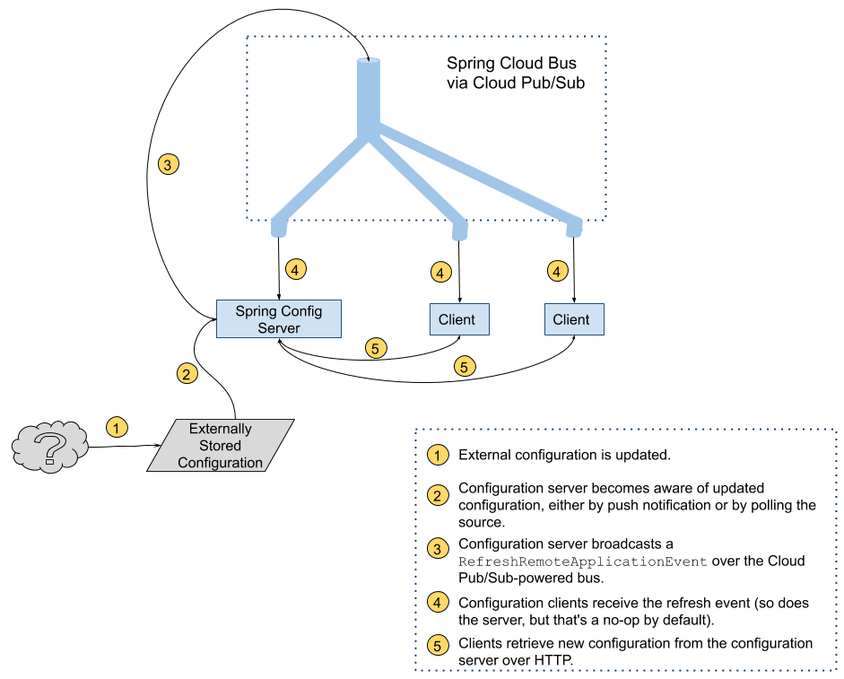

== Spring Cloud Bus

Using link:https://cloud.google.com/pubsub/[Cloud Pub/Sub] as the link:https://spring.io/projects/spring-cloud-bus[Spring Cloud Bus] implementation is as simple as importing the `spring-cloud-gcp-starter-bus-pubsub` starter.

Maven coordinates, using <<getting-started.adoc#_bill_of_materials, Spring Cloud GCP BOM>>:

[source,xml]
----
<dependency>
  <groupId>org.springframework.cloud</groupId>
  <artifactId>spring-cloud-gcp-starter-bus-pubsub</artifactId>
</dependency>
----

Gradle coordinates:

[source,groovy]
----
dependencies {
    compile group: 'org.springframework.cloud', name: 'spring-cloud-gcp-starter-bus-pubsub'
}
----

=== Configuration Management with Spring Cloud Config

Spring Cloud Bus can be used to push configuration changes from Spring Cloud Config server to the clients listening on the same bus.

To use GCP Pub/Sub as the bus implementation, both configuration server and configuration client need `spring-cloud-gcp-starter-bus-pubsub` dependency.

All other configuration is standard to https://spring.io/projects/spring-cloud-config[Spring Cloud Config].

Spring Config Server typically runs on port `8888`, and can read configuration from a link:https://cloud.spring.io/spring-cloud-config/spring-cloud-config.html#_environment_repository[variety of source control systems], and even from the local filesystem.
When the server is notified that new configuration is available, it fetches the updated configuration and sends it out via Spring Cloud Bus.

By adding the `spring-cloud-gcp-starter-bus-pubsub` dependency, you instruct Spring Cloud Bus to use Cloud Pub/Sub to broadcast configuration changes.
Spring Cloud Bus will then create a topic named `springCloudBus`, as well as a subscription for each configuration client.

Technically, every configuration server happens to also be a configuration client, subscribing to the configuration changes that it sends out.
Thus, in a scenario with one configuration server and one configuration client, two anonymous subscriptions to the `springCloudBus` topic are created.

A https://github.com/spring-cloud/spring-cloud-gcp/tree/master/spring-cloud-gcp-samples/spring-cloud-gcp-pubsub-bus-config-sample[demo application] showing configuration management and distribution over a Cloud Pub/Sub-powered bus is available.